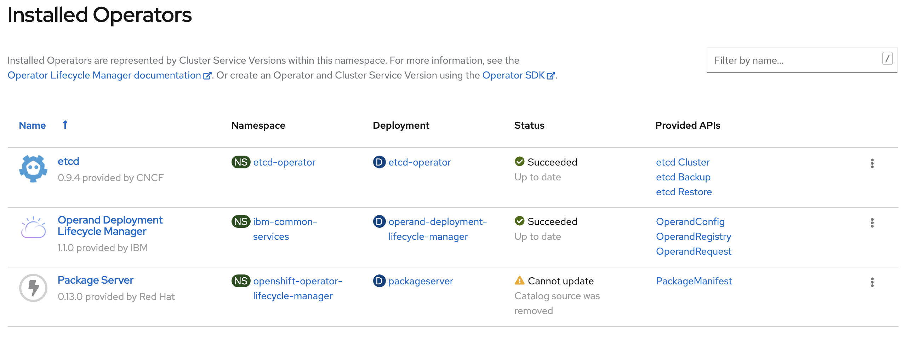
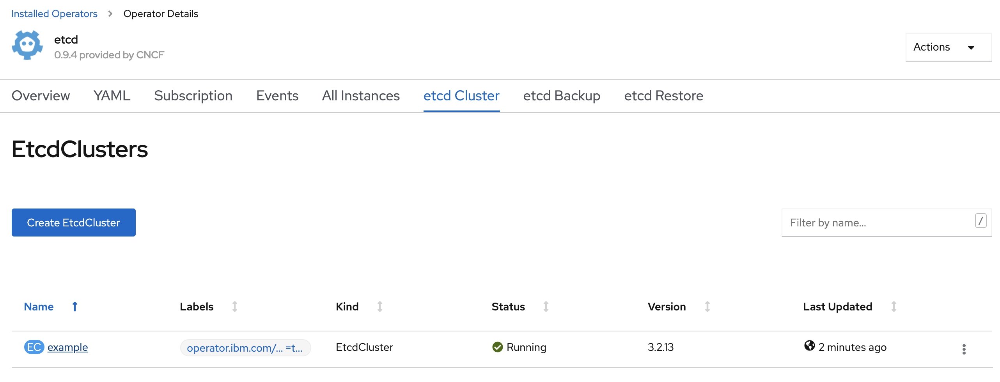
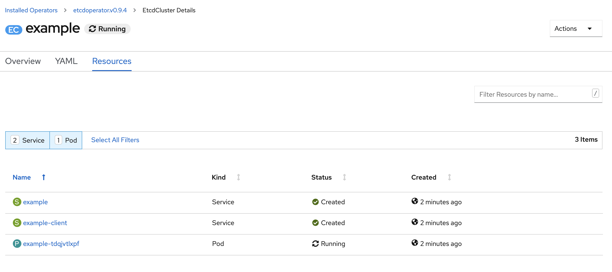

<!-- START doctoc generated TOC please keep comment here to allow auto update -->
<!-- DON'T EDIT THIS SECTION, INSTEAD RE-RUN doctoc TO UPDATE -->
**Table of Contents**  *generated with [DocToc](https://github.com/thlorenz/doctoc)*

- [How to update OperandConfig instance](#how-to-update-operandconfig-instance)
  - [OperandConfig Overview](#operandconfig-overview)
    - [How does ODLM create the individual operator CR?](#how-does-odlm-create-the-individual-operator-cr)
  - [Example](#example)

<!-- END doctoc generated TOC please keep comment here to allow auto update -->

# How to update OperandConfig instance

OperandRegistry defines the parameters that should be used to install the operator's operand

## OperandConfig Overview

OperandConfig defines the individual operand deployment configuration. The Operand Config Custom Resource (CR) defines the parameters for each operator that is listed in the OperandRegistry that should be used to install the operator instance by specifying an installation CR.

**NOTE:** When ODLM operator is deployed, it generates a default OperandConfig instance. You can edit the instance as required.

```yaml
apiVersion: operator.ibm.com/v1alpha1
Kind: OperandConfigs
metadata:
  name: common-service [1]
  namespace: ibm-common-services [2]
spec:
  services:
  # suppose metering has three CRDs
  - name: ibm-metering-operator [3]
    spec: [4]
      reader:
        key: value
        nested:
          key: value
      server:
        key: value
        nested:
          key: value
      dataManager:
        key: value
        nested:
          key: value
  ...
```

OperandConfig defines the individual operand deployment config:

  1. Name of the OperandConfig
  2. Namespace of the OperandConfig
  3. **name** is the name of the operator, which should be the same as the services name in the OperandRegistry and OperandRequest.
  4. **spec** defines a map. Its key is the kind name of the custom resource. Its value is merged to the spec field of custom resource. For more details, you can check the following topic

### How does ODLM create the individual operator CR?

Suppose IAM Operator has two CRDs: Apikey and Identity:

    The OperandConfig CR has

    ```yaml
    - name: iam
    spec:
      apikey:
        key1: value1
        key2:
          nested-key: value2
      identity:
        key3: value3
    ```

The IAM Operator CSV has

```yaml
apiVersion: operators.coreos.com/v1alpha1
kind: ClusterServiceVersion
metadata:
  annotations:
    alm-examples: |-
      [
        {
          "apiVersion": "iam.operator.ibm.com/v1alpha1",
          "kind": "Apikey",
          "metadata": {
            "name": "iam-apikey"
          },
          "spec": {
            "key1": "value"
          }
        },
        {
          "apiVersion": "iam.operator.ibm.com/v1alpha1",
          "kind": "Identity",
          "metadata": {
            "name": "iam-identity"
          },
          "spec": {
            "key3": "value"
          }
        }
      ]
```

The ODLM will deep merge the OperandConfig CR spec and IAM Operator CSV alm-examples to create the IAM CR.

```yaml
apiVersion: iam.operator.ibm.com/v1alpha1
kind: Apikey
metadata:
  name: iam-apikey
spec:
  key1: value1
  key2:
    nested-key: value2
---
apiVersion: iam.operator.ibm.com/v1alpha1
kind: Identity
metadata:
  name: iam-identity
spec:
  key3: value3
```

For day2 operations, the ODLM will patch the OperandConfigs CR spec to the existing IAM CR.

Typically, users update the individual operator CR for day2 operations, but OperandConfig still provides the ability for individual operator/operand day2 operation.

## Example

Taking etcd operator as an example

1. ODLM has been deployed and OperandConfig, OperandRegistry and OperandRequest instances have been created

OperandConfig:

```yaml
apiVersion: operator.ibm.com/v1alpha1
kind: OperandConfig
metadata:
  name: common-service
  namespace: ibm-common-services
spec:
  services:
    - name: etcd
      spec:
        etcdCluster:
          size: 1
```

Set etcd cluster size to 1

OperandRegistry:

```yaml
apiVersion: operator.ibm.com/v1alpha1
kind: OperandRegistry
metadata:
  name: common-service
  namespace: ibm-common-services
spec:
  operators:
    - channel: singlenamespace-alpha
      name: etcd
      namespace: etcd-operator
      packageName: etcd
      scope: private
      sourceName: community-operators
      sourceNamespace: openshift-marketplace
```

OperandRequest:

```yaml
apiVersion: operator.ibm.com/v1alpha1
kind: OperandRequest
metadata:
  name: common-service
  namespace: ibm-common-services
spec:
  requests:
    - operands:
        - name: etcd
      registry: common-service
      registryNamespace: ibm-common-services
```

1. Etcd operator and operands has been created



ODLM and etcd operators are deployed.



Etcd operator custom resource `etcdcluster/example` is created



There is one etcd pod.

1. Update OperandConfig

OperandConfig:

```yaml
apiVersion: operator.ibm.com/v1alpha1
kind: OperandConfig
metadata:
  name: common-service
  namespace: ibm-common-services
spec:
  services:
    - name: etcd
      spec:
        etcdCluster:
          size: 3
```

Update etcd cluster size to 3.


Etcd pods are increased to 3.
