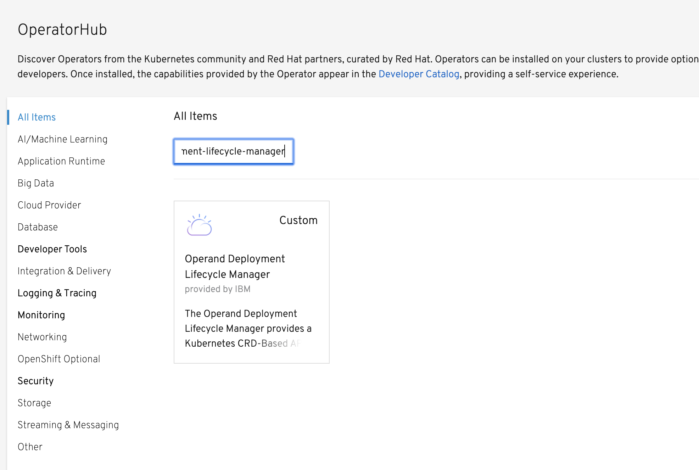
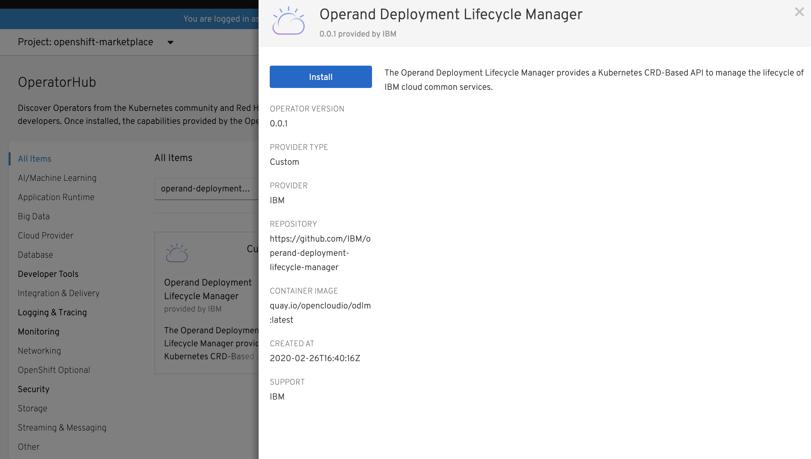
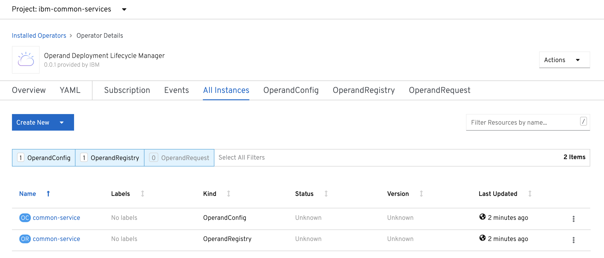
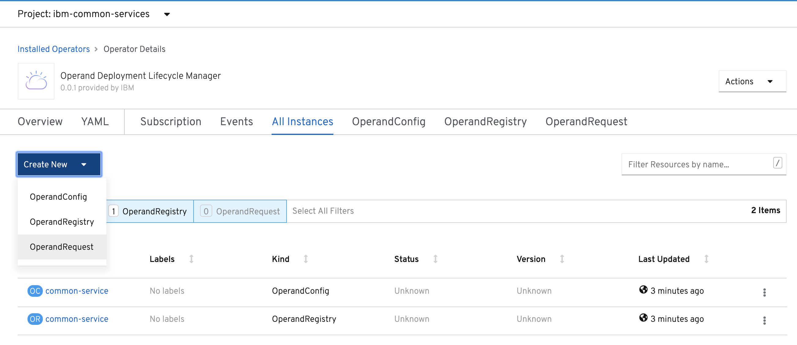

<!-- START doctoc generated TOC please keep comment here to allow auto update -->
<!-- DON'T EDIT THIS SECTION, INSTEAD RE-RUN doctoc TO UPDATE -->
**Table of Contents**  *generated with [DocToc](https://github.com/thlorenz/doctoc)*

- [Install the operand deployment lifecycle manager](#install-the-operand-deployment-lifecycle-manager)
  - [Install the operand deployment lifecycle manager On OCP 4.x](#install-the-operand-deployment-lifecycle-manager-on-ocp-4x)
    - [1. Create OperatorSource](#1-create-operatorsource)
    - [2. Create a Namespace `ibm-common-services`](#2-create-a-namespace-ibm-common-services)
    - [3. Install operand deployment lifecycle manager](#3-install-operand-deployment-lifecycle-manager)
      - [Search ODLM Package in the OperatorHub](#search-odlm-package-in-the-operatorhub)
      - [Install ODLM Operator](#install-odlm-operator)
    - [4. Manage Other Operators with ODLM](#4-manage-other-operators-with-odlm)
      - [Create Operand Request](#create-operand-request)
      - [Enable or Delete an Operator](#enable-or-delete-an-operator)
  - [Install the operand deployment lifecycle manager On OCP 3.11](#install-the-operand-deployment-lifecycle-manager-on-ocp-311)
    - [0. Install OLM](#0-install-olm)
    - [1. Build Operator Registry image](#1-build-operator-registry-image)
    - [2. Create CatalogSource](#2-create-catalogsource)
    - [3. Create Operator NS, Group, Subscription](#3-create-operator-ns-group-subscription)
    - [4. Check Operator CSV](#4-check-operator-csv)
  - [Post-installation](#post-installation)

<!-- END doctoc generated TOC please keep comment here to allow auto update -->

# Install the operand deployment lifecycle manager

## Install the operand deployment lifecycle manager On OCP 4.x

### 1. Create OperatorSource

Before install ODLM, this operator source should be created, you can use OCP UI or CLI create it.

- Use UI:
Click the plus button, and then copy the above operator source into the editor.


- Use CLI:
Open OCP console, click the `Plus` button on the top right and paste the following content, then click `Create`.

```yaml
apiVersion: operators.coreos.com/v1
kind: OperatorSource
metadata:
  name: opencloud-operators
  namespace: openshift-marketplace
spec:
  authorizationToken: {}
  displayName: IBMCS Operators
  endpoint: https://quay.io/cnr
  publisher: IBM
  registryNamespace: opencloudio
  type: appregistry
```

Check if all the operator packages are loaded, run command:

```bash
# oc -n openshift-marketplace get operatorsource opencloud-operators -o jsonpath="{.status.packages}"
ibm-mongodb-operator-app,ibm-management-ingress-operator-app,ibm-cert-manager-operator-app,ibm-licensing-operator-app,cp4foobar-operator-app,ibm-metering-operator-app,ibm-auditlogging-operator-app,meta-operator-app,ibm-ingress-nginx-operator-app,ibm-iam-operator-app,ibm-healthcheck-operator-app,ibm-meta-operator-bridge-app,operand-deployment-lifecycle-manager-app,ibm-catalog-operator-app,ibm-commonui-operator-app
```

During development, we need to update the csv package frequently, but the operator source need a long time to sync the new package, my experience is to re-create this operator source, the new package will be loaded immediately.

```bash
oc delete -f opencloudio-source.yaml
oc apply -f opencloudio-source.yaml
```

### 2. Create a Namespace `ibm-common-services`

Open the `OperatorHub` page in OCP console left menu, then `Create Project`, e.g., create a project named `ibm-common-services`.


### 3. Install operand deployment lifecycle manager

#### Search ODLM Package in the OperatorHub

Type `operand-deployment-lifecycle-manager` in the search box
Open `OperatorHub` and search `operand-deployment-lifecycle-manager` to find the operator, and install it.

#### Install ODLM Operator



Select the namespace `ibm-common-services` that created in step [Create Project](#create-project)


Waiting for about 1 minute, `OperandRegistry` and `OperandConfig` operand will be ready


So far, the ODLM operator installs completed. Next, we can start to install other common service operators.

### 4. Manage Other Operators with ODLM

#### Create Operand Request

Select `OperandRequest` from `Create New` button


Modify the `OperandRequest` to add the operator you want to install into `spec.requests.operands`


The list of operators you can add:

```bash
    - name: ibm-cert-manager-operator
    - name: ibm-mongodb-operator
    - name: ibm-iam-operator
    - name: ibm-monitoring-exporters-operator
    - name: ibm-monitoring-prometheusext-operator
    - name: ibm-healthcheck-operator
    - name: ibm-management-ingress-operator
    - name: ibm-ingress-nginx-operator
    - name: ibm-metering-operator
    - name: ibm-licensing-operator
    - name: ibm-commonui-operator
    - name: ibm-auditlogging-operator
    - name: ibm-catalog-operator
    - name: ibm-platform-api-operator
    - name: ibm-helm-api-operator
    - name: ibm-helm-repo-operator
    - name: ibm-management-repo-operator
```

After the `OperandRequest` created, we can click the left navigation tree `Installed Operators` to check if our common services install successfully.


#### Enable or Delete an Operator

- Enable an operator, you can add the operator into the `OperandRequest`

- Delete an operator, you can remove the operator from the`OperandRequest`

## Install the operand deployment lifecycle manager On OCP 3.11

### 0. Install OLM

```bash
curl -sL https://github.com/operator-framework/operator-lifecycle-manager/releases/download/0.13.0/install.sh | bash -s 0.13.0
```

### 1. Build Operator Registry image

> You need to remove the last `type: object` in all CRDs to avoid the following error: The CustomResourceDefinition "operandconfigs.operator.ibm.com" is invalid: spec.validation.openAPIV3Schema: Invalid value: apiextensions.JSONSchemaProps ..... must only have "properties", "required" or "description" at the root if the status subresource is enabled

```bash
cd deploy
docker build -t quay.io/opencloudio/operator-registry -f operator-registry.Dockerfile .
docker push quay.io/opencloudio/operator-registry
```

### 2. Create CatalogSource

```yaml
apiVersion: operators.coreos.com/v1alpha1
kind: CatalogSource
metadata:
  name: opencloud-operators
  namespace: olm
spec:
  sourceType: grpc
  image: quay.io/opencloudio/operator-registry:latest
```

### 3. Create Operator NS, Group, Subscription

```yaml
apiVersion: v1
kind: Namespace
metadata:
  name: ibm-common-services

---
apiVersion: operators.coreos.com/v1alpha2
kind: OperatorGroup
metadata:
  name: operatorgroup
  namespace: ibm-common-services
spec:
  targetNamespaces:
  - ibm-common-services

---
apiVersion: operators.coreos.com/v1alpha1
kind: Subscription
metadata:
  name: operand-deployment-lifecycle-manager
  namespace: ibm-common-services
spec:
  channel: alpha
  name: operand-deployment-lifecycle-manager-app
  source: opencloud-operators
  sourceNamespace: olm
```

### 4. Check Operator CSV

```bash
oc -n operand-deployment-lifecycle-manager get csv
```

<!--

## Create and update custom resource

### 1. Update OperandConfig and OperandRegistry custom resource

Operand Deployment Lifecycle Manager defines three custom resource definitions OperandConfig, OperandRequest and OperandRegistry and it creates two example custom resources for OperandConfig and OperandRegistry.

In the `Operator Details` page, three generated custom resource definition are list in a line with the `Overview`. Check the custom resource definition name, then you can update the example custom resource.

For the OperandConfig,
OperandConfig defines the individual common service CR information:

```yaml
apiVersion: operator.ibm.com/v1alpha1
kind: OperandConfig
metadata:
  name: common-service
spec:
  services:
  - name: jenkins
    spec:
      jenkins:
        service:
          port: 8081
  - name: etcd
    spec:
      etcdCluster:
        size: 1
```

Take the jenkins operator as an example.
- The `name` field defines the name of the operator.
- The `spec` field defines the `spec` configuration for each custom resource.

```yaml
      jenkins:
        service:
          port: 8081
```

will overwrite the `spec` of the custom resource `Jenkins`

```yaml
apiVersion: jenkins.io/v1alpha2
kind: Jenkins
metadata:
  ...
  name: example
  namespace: jenkins-operator
spec:
  ...
  service:
    port: 8081
    type: ClusterIP
```

For the OperandRegistry,
OperandRegistry defines the individual common service operator information:

```yaml
apiVersion: operator.ibm.com/v1alpha1
kind: OperandRegistry
metadata:
  name: common-service
spec:
  operators:
  - name: jenkins
    namespace: jenkins-operator
    channel: alpha
    packageName: jenkins-operator
    sourceName: community-operators
    sourceNamespace: openshift-marketplace
    targetNamespaces:
      - jenkins-operator
  - name: etcd
    namespace: etcd-operator
    channel: singlenamespace-alpha
    packageName: etcd
    sourceName: community-operators
    sourceNamespace: openshift-marketplace
    targetNamespaces:
      - etcd-operator
```

The `operators` list defines the operator lifecycle management information for each operator.
Taking the jenkins as an example:
- `name` is the name of the operator, which should be the same as the services name in the `OperandConfig` and `OperandRequest`.
- `namespace` is the namespace the operator will be deployed in.
- `channel` is the name of a tracked channel.
- `packageName` is the name of the package in `CatalogSource` will be deployed.
- `sourceName` is the name of the `CatalogSource`.
- `sourceNamespace` is the namespace of the `CatalogSource`.
- `targetNamespaces` is a list of namespaces, which `OperaterGroup` generates RBAC access for its member Operators to get access to. `targetNamespaces` is used to control the operator dependency. `targetNamespaces` should include all the namespaces of its dependent operators and its own namespace.
- `description` is used to add a detailed description for service including clarifying the dependency.

### 2. Create OperandRequest custom resource

OperandRequest defines the individual common service state, such as an individual common service that should be present or absent.

OperandRequest can be created in the `OperandRequest` tags

This is an example of the OperandRequest custom resource:

```yaml
apiVersion: operator.ibm.com/v1alpha1
Kind: OperandRequest
metadata:
  name: common-service
spec:
  services:
  - name: jenkins
    channel: alpha
    state: present
    description: The jenkins service
  - name: etcd
    channel: singlenamespace-alpha
    state: absent
    description: The etcd service
```

- `services` is a list defines the set for each service.
- `name` is the service name, which should be the same as the services name in the `OperandConfig` and operator name in the `OperandRegistry`.
- `channel` is an optional setting, it can overwrite the `channel` defined in the `OperandRegistry`.
- `state` defines if the service should be present or absent.
- `description` is the description of the service.

-->

## Post-installation

The operators and their custom resource would be deployed in the cluster, and thus the installation of operands will also triggered by the CR.
